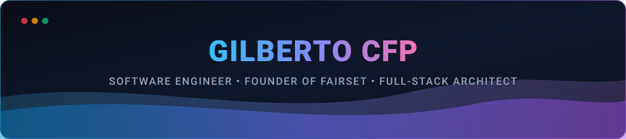

<!-- Native Vector Wave Header -->

<!-- Typing Animation -->

  

<!-- Platform & Social Badges -->

  
  
  
  

  
  
  

---

### Project Spotlight: [FairSet](https://fairset.com.br/) — Volleyball Platform &amp; Analytics

> **FairSet** is an active volleyball ecosystem with **800+ active users**, available natively on **iOS (App Store)**, **Android (Google Play)**, and **Web**. Engineered for casual matches (*peladas*), competitive teams, practices, and tournaments.

<table>
  <tr>
    <td width="50%" valign="top">
      <h4>Match Scoring &amp; Official Scoresheets</h4>
      
Real-time live scoreboard with concurrency locking for practices, comprehensive official match scoresheets (<i>súmulas</i> with rotations, substitutions, sanctions, and timeouts), and offline scoring support.

    </td>
    <td width="50%" valign="top">
      <h4>1v1 Duels &amp; TrueSkill Ratings</h4>
      
Advanced post-match player evaluation engine based on pairwise 1v1 duel voting aggregated into calibrated, zero-sum TrueSkill Bayesian statistical rating progression.

    </td>
  </tr>
  <tr>
    <td width="50%" valign="top">
      <h4>Team Treasury &amp; Financial Management</h4>
      
Complete team cash flow and monthly subscription management (<i>mensalidades</i>), integrated with automated PIX and credit card processing via Asaas.

    </td>
    <td width="50%" valign="top">
      <h4>Gamification &amp; Player Progression</h4>
      
XP-driven progression algorithm, difficulty-ranked team missions, custom badge awards, and position-specific skill tracking across all 6 volleyball roles.

    </td>
  </tr>
</table>

  

---

### Tech Stack &amp; Architecture

  

#### Languages

  
  
  
  
  
  
  

#### Frontend &amp; Native Mobile

  
  
  
  
  
  

#### Backend &amp; Distributed Architecture

  
  
  
  
  

#### Cloud Infrastructure (AWS &amp; GCP)

  
  
  
  
  
  
  
  
  
  

#### Artificial Intelligence, Multi-Agent &amp; ALM

  
  
  
  

#### Databases &amp; ORMs

  
  
  
  

---

### GitHub Activity &amp; Insights

  <table border="0">
    <tr>
      <td align="center" valign="middle">
        
      </td>
      <td align="center" valign="middle">
        
      </td>
    </tr>
  </table>

